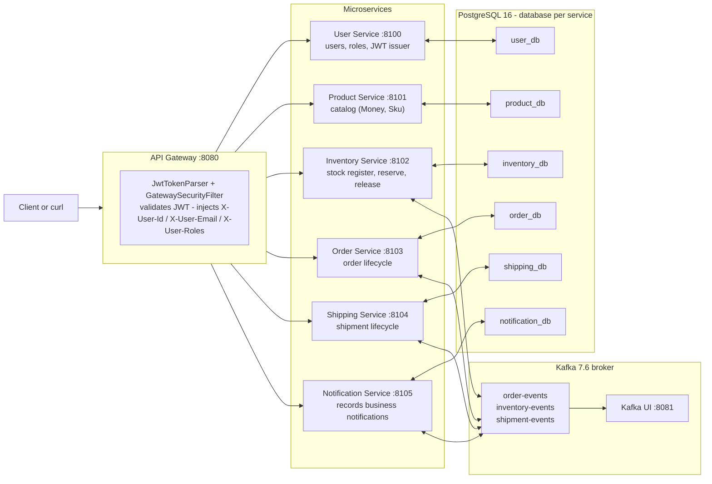
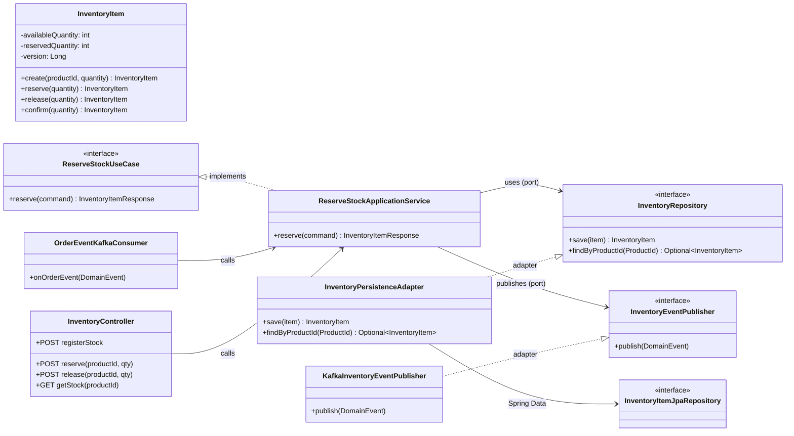
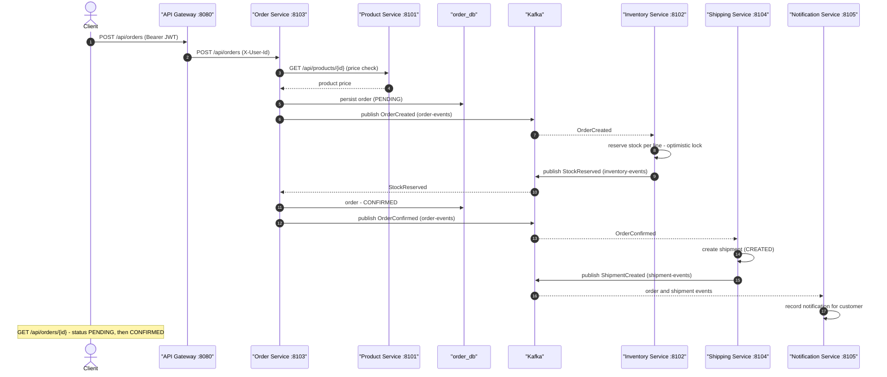

# LogiCore

A distributed **logistics management platform** built as a portfolio project: Java 17, Spring Boot 3.2, **event-driven microservices**, **hexagonal architecture**, Kafka, PostgreSQL, and Testcontainers.

Orders flow through a **saga-style choreography**: an `OrderCreated` event triggers stock reservation in the Inventory Service, which confirms or fails the order; confirmed orders are picked up by the Shipping Service; every step is observed by the Notification Service. Each service owns its own database and conversation is **eventual consistency**.

---

## Modules

| Module | Port | Responsibility |
|---|---|---|
| `api-gateway` | 8080 | Spring Cloud Gateway — single entry point. **Validates JWTs**, injects identity headers (`X-User-Id`, `X-User-Roles`) into downstream services, CORS |
| `user-service` | 8100 | Users, roles. **Issues JWT** (`/api/auth/login`), BCrypt password hashing |
| `product-service` | 8101 | Product catalog with `Money`/`Sku` value objects |
| `inventory-service` | 8102 | Stock register/reserve/release. **Optimistic locking** (`@Version`) against concurrent reservations. Consumes `OrderCreated` |
| `order-service` | 8103 | Order lifecycle. Publishes `OrderCreated`, consumes `StockReserved`/`StockReservationFailed` |
| `shipping-service` | 8104 | Shipment lifecycle. Consumes `OrderConfirmed` |
| `notification-service` | 8105 | Records business notifications from order & shipment events |
| `shared/common-dto` | — | Shared event contract (`DomainEvent` envelope + payloads + `EventTypes`) — no domain logic |

**Infrastructure** (docker-compose): PostgreSQL 16 (one database per service), Kafka 7.6 + Zookeeper, Kafka UI at `http://localhost:8081`.

---

## Architecture

- **Hexagonal** in every service: `domain` (framework-free) ← `application` (ports + use cases) ← `adapter` (HTTP/Kafka/JPA). Dependencies point inward; the core is testable without Spring.
- **Events**: all messages share a `DomainEvent` envelope (`eventId`, `eventType`, `occurredAt`, `correlationId`, `payload`) consumed as raw `DomainEvent<?>` and mapped to concrete payloads with Jackson (avoids generic type-erasure pitfalls).
- **Idempotency (ADR-006)**: every consuming service persists processed `eventId`s and applies each event at most once.
- **Compensation**: if any order line cannot be reserved, previously reserved lines are released and a `StockReservationFailed` event is published.

```
1. POST /api/orders            Order Service: persist PENDING → publish OrderCreated
2. OrderCreated → Kafka        Inventory Service: reserve per line → StockReserved | StockReservationFailed
3. StockReserved               Order Service: order → CONFIRMED (ShipmentCreated later)
   StockReservationFailed      Order Service: order → FAILED (+ StockReleased compensation)
4. OrderConfirmed → Kafka      Shipping Service: create shipment
5. All events → Kafka          Notification Service: record notifications (per customer)
```

### Decisions
Architecture decisions are recorded as ADRs in [`docs/adr/`](docs/adr/):
`001-microservices`, `002-hexagonal`, `003-database-per-service`, `004-kafka`, `005-optimistic-locking`,
`006-eventual-consistency`, `007-transactional-outbox` (proposed), `008-jwt-gateway-authentication`.
Full plan and decisions: [`docs/IMPLEMENTATION-PLAN.md`](docs/IMPLEMENTATION-PLAN.md), [`docs/DECISIONS.md`](docs/DECISIONS.md).

---

## UML diagrams

All diagrams (rendered with GitHub-Mermaid) live in [`docs/UML.md`](docs/UML.md). The three most important:

**1. System architecture** — one gateway, six services, one database per service, Kafka as the async backbone.



**2. Hexagonal architecture** — same shape in every service (example: `inventory-service`). Arrows point inward; the domain is free of Spring/JPA/Kafka.



**3. Order saga — happy path** — the async choreography: `OrderCreated` → reserve → `StockReserved` → `OrderConfirmed` → shipment → notifications.



Also in [`docs/UML.md`](docs/UML.md): **saga failure + compensation**, **JWT authentication flow**, and the **Order / Shipment state machines**.

---

## Quick start

Prerequisites: **JDK 17**, **Maven 3.9+**, **Docker** (for the integration tests and infra).

```bash
# 1. Start infrastructure (PostgreSQL multi-db + Kafka + Kafka UI)
docker compose up -d
# databases: user_db, product_db, order_db, inventory_db, shipping_db, notification_db

# 2. Build everything (unit + integration tests)
mvn clean verify

# No Docker right now? Run only the unit tests
mvn test

# 3. Run services (each in its own terminal, or from an IDE)
mvn -pl api-gateway spring-boot:run
mvn -pl user-service spring-boot:run
mvn -pl product-service spring-boot:run
mvn -pl inventory-service spring-boot:run
mvn -pl order-service spring-boot:run
mvn -pl shipping-service spring-boot:run
mvn -pl notification-service spring-boot:run
```

### Configuration via environment variables

| Variable | Default | Used by |
|---|---|---|
| `SERVER_PORT` | per service | all |
| `DB_URL`, `DB_USER`, `DB_PASSWORD` | `localhost:5432/<db>` / `logicore` | all services |
| `KAFKA_BOOTSTRAP_SERVERS` | `localhost:9092` | kafka services |
| `JWT_SECRET` | dev-only default | user-service + gateway (**must override in real environments**) |
| `USER_SERVICE_URI`, `PRODUCT_SERVICE_URI`, … | `http://localhost:810x` | api-gateway routes |

---

## API walkthrough

Everything goes through the gateway (`http://localhost:8080`). Register/login are public; all other endpoints require `Authorization: Bearer <token>`.

```bash
# 1. Register a customer
curl -s -X POST localhost:8080/api/auth/register -H "Content-Type: application/json" \
  -d '{"email":"jane@example.com","password":"s3cret!","name":"Jane Doe","role":"CUSTOMER"}'

# 2. Login and grab the JWT (power shell-friendly: extract with a tool like jq)
curl -s -X POST localhost:8080/api/auth/login -H "Content-Type: application/json" \
  -d '{"email":"jane@example.com","password":"s3cret!"}'
# -> { "token": "<jwt>", "tokenType": "Bearer", "expiresAt": "...", "user": {...} }
TOKEN=<paste-yours>

# 3. Create a product
curl -s -X POST localhost:8080/api/products -H "Authorization: Bearer $TOKEN" -H "Content-Type: application/json" \
  -d '{"sku":"SKU-MOUSE-01","name":"Wireless Mouse","description":"2.4 GHz","price":"19.99"}'

# 4. Register stock for that product
curl -s -X POST localhost:8080/api/inventory -H "Authorization: Bearer $TOKEN" -H "Content-Type: application/json" \
  -d '{"productId":"<product-id>","quantity":100}'

# 5. Place an order (Inventory Service reacts asynchronously via Kafka)
curl -s -X POST localhost:8080/api/orders -H "Authorization: Bearer $TOKEN" -H "Content-Type: application/json" \
  -d '{"customerId":"<your-user-id>","items":[{"productId":"<product-id>","quantity":2}]}'
# track: GET /api/orders/<order-id>   -> status PENDING → CONFIRMED (or FAILED)

# 6. Shipment lifecycle + notifications
curl -s -X POST localhost:8080/api/shipments/<shipment-id>/ship -H "Authorization: Bearer $TOKEN"
curl -s localhost:8080/api/notifications/correlation/<order-id> -H "Authorization: Bearer $TOKEN"
```

OpenAPI (Swagger UI) is available per service directly at `http://localhost:<port>/swagger-ui.html`.

---

## Testing

- **Unit tests** (no Spring, Mockito): domain invariants, use cases, Kafka consumer mapping, JWT/gateway filter. Run with `mvn test`.
- **Integration tests** (`*IT`, Testcontainers + real PostgreSQL/Kafka): auth round-trip and JWT parsing (`user-service`), **concurrent reservations optimistic-locking / lost-update proof** and `OrderCreated`→stock-reserved flow (`inventory-service`), `OrderCreated` publishing onto Kafka (`order-service`). Run with `mvn verify` (needs Docker; auto-skipped otherwise).

CI runs `mvn verify` on GitHub Actions (`.github/workflows/ci.yml`).