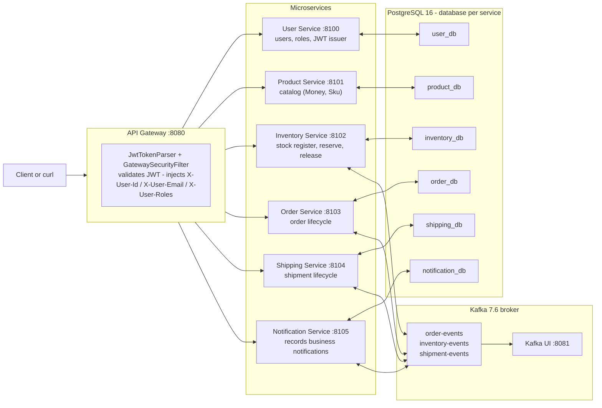
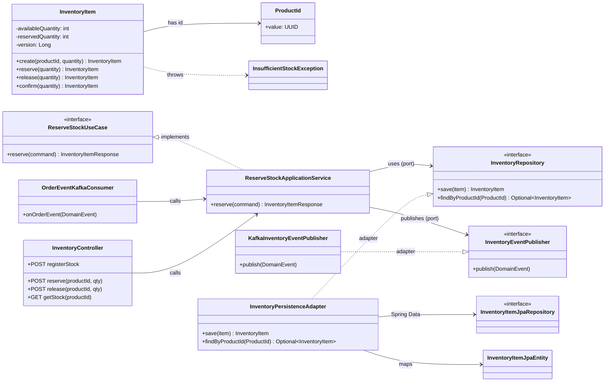
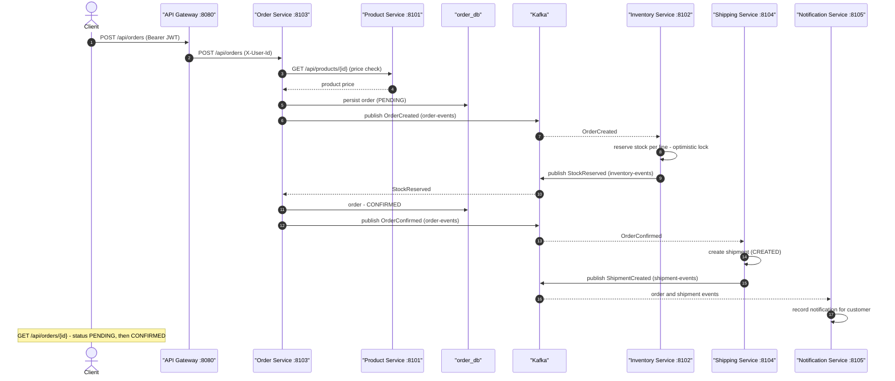
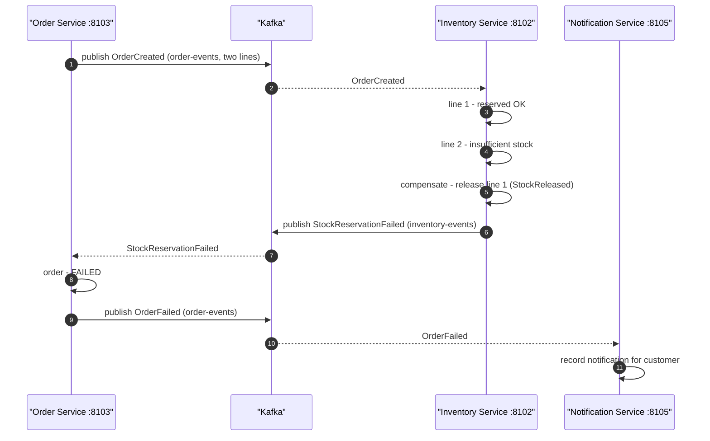
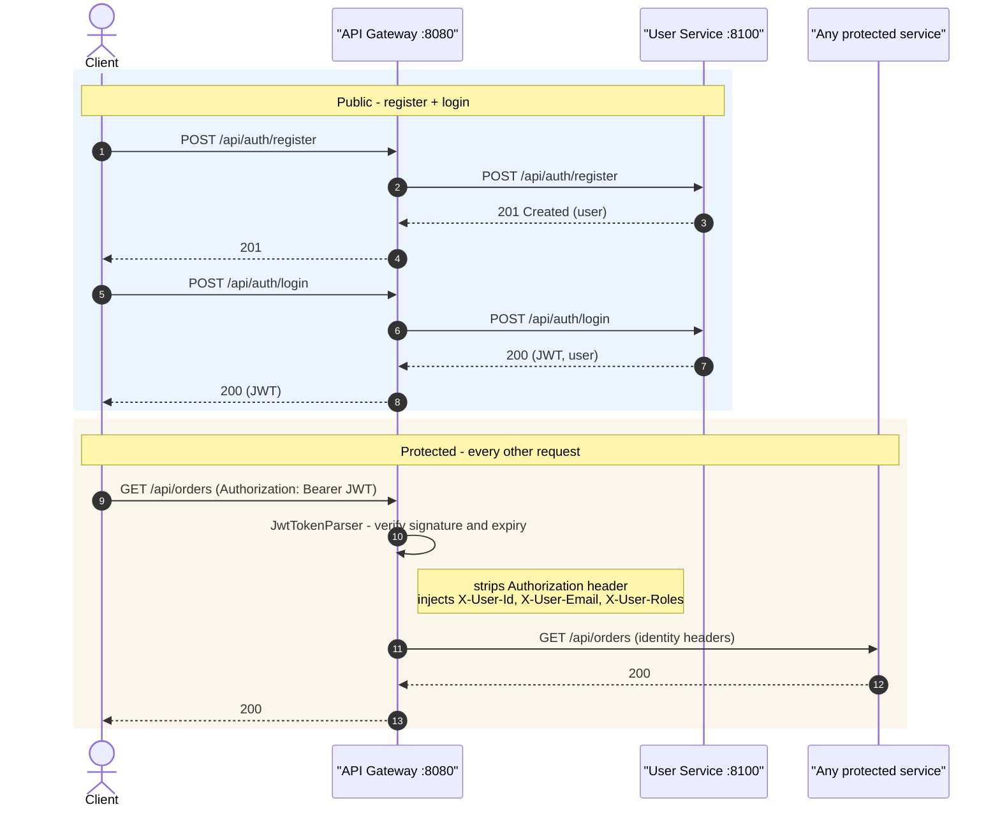
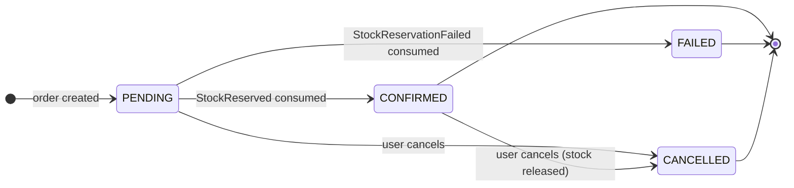
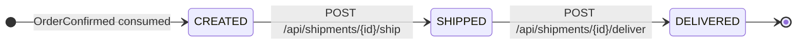

# LogiCore — UML Diagrams

Rendered natively by GitHub (Mermaid). These diagrams complement the architecture
decisions in [`DECISIONS.md`](DECISIONS.md) and [`IMPLEMENTATION-PLAN.md`](IMPLEMENTATION-PLAN.md).

1. [System architecture (component diagram)](#1-system-architecture)
2. [Hexagonal architecture (class diagram, inventory-service)](#2-hexagonal-architecture)
3. [Order saga — happy path (sequence diagram)](#3-order-saga--happy-path)
4. [Order saga — failure and compensation (sequence diagram)](#4-order-saga--failure-and-compensation)
5. [Authentication with JWT (sequence diagram)](#5-authentication-with-jwt)
6. [Order state machine](#6-order-state-machine)
7. [Shipment state machine](#7-shipment-state-machine)

---

## 1. System architecture

Component view of the whole platform: one entry point (API Gateway), six services with
one PostgreSQL database each, and a Kafka broker as the backbone of event-driven
conversation. The gateway is the only component that parses JWTs; every downstream
service trusts the identity headers it injects (ADR-008).

**What to look at.** All synchronous REST traffic goes through `:8080`; all async traffic
goes through Kafka. Services never talk to each other over HTTP — the only service-to-
service HTTP call is Order Service validating prices against Product Service. Each
service persists only in its own database (ADR-003).

---

## 2. Hexagonal architecture

Every service follows the same shape; this class diagram uses `inventory-service` as the
example. The **domain aggregate** (`InventoryItem`) is plain Java with no Spring imports.
The **application layer** declares inbound *ports* (`ReserveStockUseCase`) and outbound
*ports* (`InventoryRepository`, `InventoryEventPublisher`) and runs the use cases. The
**adapter layer** implements those ports: REST + Kafka consumers (inbound) and JPA +
Kafka producer (outbound).

**What to look at.** Arrows point "inward": the application service depends only on
interfaces, never on Spring, JPA, Kafka, or HTTP. Swapping PostgreSQL for MongoDB or REST
for gRPC touches only the adapter boxes.

---

## 3. Order saga — happy path

The core choreography. The order is persisted as `PENDING` and an `OrderCreated` event
starts the saga. Inventory reserves per line (optimistic lock), then the order is
confirmed, a shipment is created, and notifications are recorded at each step. No database
spans more than one service; correctness comes from events + idempotency (ADR-006).

**What to look at.** The gateway returns immediately after persisting the order; the rest
is asynchronous. Inventory and Shipping never know each other exist — they only react to
events, which is what makes the architecture decoupled and independently deployable.

---

## 4. Order saga — failure and compensation

Same saga, but one order line can trigger a failure. Example with two lines: line 1 is
reserved, line 2 cannot be fulfilled. In a distributed transaction this would be a rollback
problem; here it is solved with a **compensating action** (release line 1) and an explicit
`StockReservationFailed` event that moves the order to `FAILED`.

**What to look at.** There is no single "transaction": each service commits its own work and
emits an event; problems are repaired with compensating events instead of rollbacks
(ADR-005, ADR-006).

---

## 5. Authentication with JWT

User Service is the only component allowed to issue tokens; the gateway validates every
incoming JWT **offline** (shared `JWT_SECRET`, HS256) and forwards identity headers. This
keeps the protected services free of token logic.

**What to look at.** Login is BCrypt-checked in User Service; the JWT carries
`sub`/`email`/`roles`. The gateway verifies it without calling any service, and protected
services trust the injected headers (trusted network, ADR-008).

---

## 6. Order state machine

`Order` (order-service) — `PENDING` is the only initial state; `CONFIRMED`/`FAILED`
arrive asynchronously from the inventory outcome.

---

## 7. Shipment state machine

`Shipment` (shipping-service) — created automatically when an order is confirmed, then
advanced by explicit operations.

